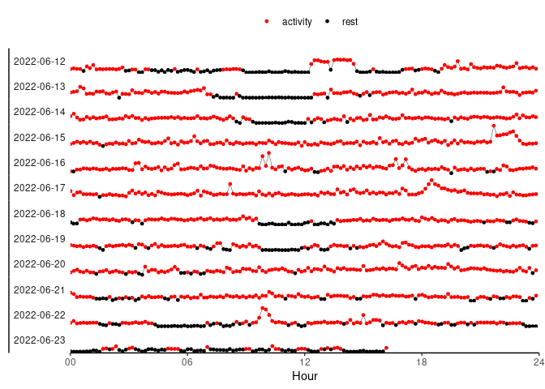

<!-- README.md is generated from README.Rmd. Please edit that file -->

# accr

<!-- badges: start -->

<!-- badges: end -->

The goal of accr is to provide a toolkit for working with accelerometer
data from small animal studies.

**Note:** This package is currently in the alpha stage, and its
functionality may change significantly in the near future.

## Installation

You can install the development version of accr from
[GitHub](https://github.com/mpio-be/accr) with:

``` r
remotes::install_github("mpio-be/accr")
```

## Example

This is a basic example which shows how to plot an actogram while
computing a resting threshold on the fly.

``` r
library(accr)
data(pesaODBA)
setODBA(pesaODBA, "datetime_", "ODBA")
actogram(pesaODBA, threshold = resting_threshold)
```


